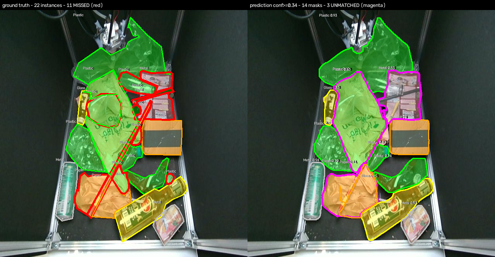
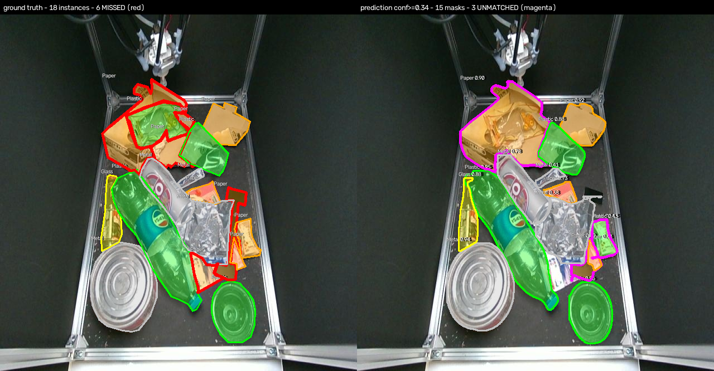
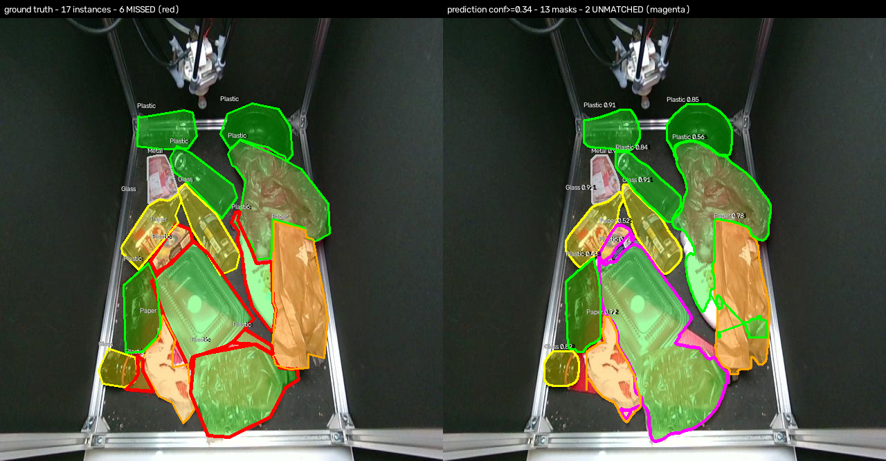
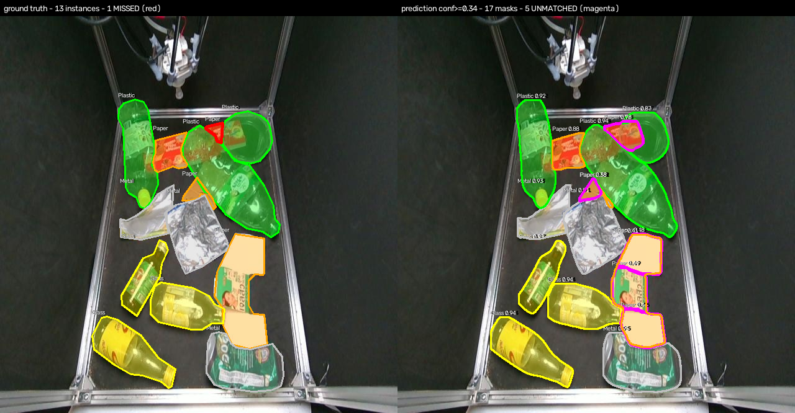
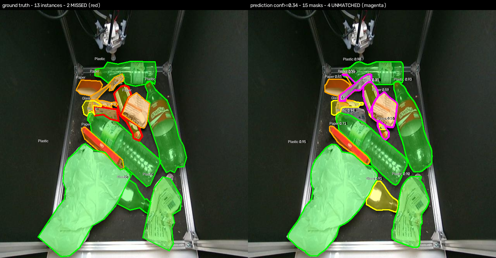
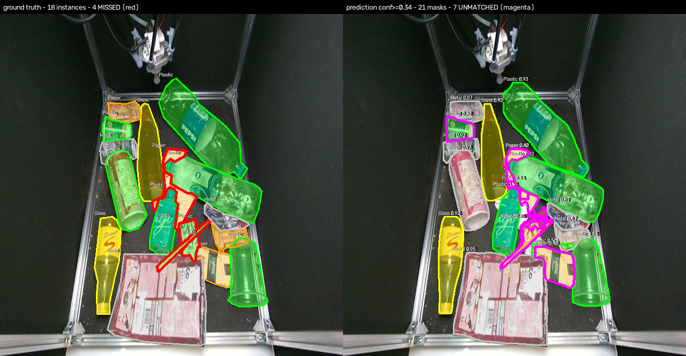
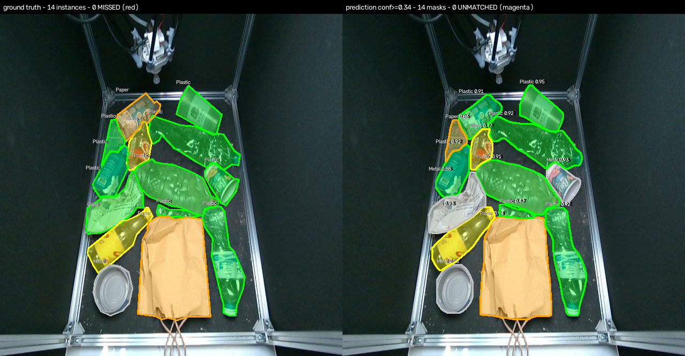
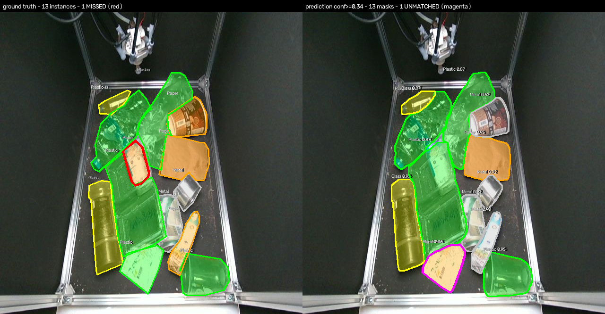

# Commented error examples

Split `test`, matching on mask IoU >= 0.5 at confidence >= 0.34, class-agnostic, greedy one-to-one (the convention of §7.1).

Left panel is ground truth, right panel the predictions. **Red** outlines mark ground-truth instances the model did not find; **magenta** outlines mark predictions that matched no ground-truth instance. Class fills use the dataset's own colour convention.

**Licence.** Source images are from the BUU Waste Occlusion Dataset (BUU-WOD), VisionLab, Burapha University, used under CC BY 4.0 (<https://creativecommons.org/licenses/by/4.0/>). **Modified:** polygon fills, outlines and class labels were drawn over the originals by this project. The underlying images and annotations were not altered.

## False negatives - objects the model did not find

### 1. `rgb_20250618_163749_png.rf.a6d00d8e41c4e3c60d85ae3f29717732`

`rgb_20250618_163749_png.rf.a6d00d8e41c4e3c60d85ae3f29717732` - ground truth 22 instances, 14 predictions. True positives **10**, missed **11**, false positives **3**, confused **1**.
On this image: recall **0.50**, precision **0.79**.

- **Missed (11):** Metal 2, Paper 2, Plastic 7. Median ground-truth area 3,026 px, which is size quartile **q1** of 4 for this split.
- **Unmatched predictions (3):** Metal 0.83, Paper 0.70, Plastic 0.53.
  **1 of these sit on an instance that was already matched** — a duplicate detection — and **2 overlap no instance at all**. Matching is one-to-one, so a second prediction on a correctly detected object cannot match and is counted as a false positive although it covers a real object.
- **Confused:** Plastic -> Paper x1.

### 2. `rgb_20250618_161455_png.rf.53c0f305183cd6b9371274fe6dd1d491`

`rgb_20250618_161455_png.rf.53c0f305183cd6b9371274fe6dd1d491` - ground truth 18 instances, 15 predictions. True positives **11**, missed **6**, false positives **3**, confused **1**.
On this image: recall **0.67**, precision **0.80**.

- **Missed (6):** Paper 5, Plastic 1. Median ground-truth area 2,880 px, which is size quartile **q1** of 4 for this split.
- **Unmatched predictions (3):** Paper 0.90, Paper 0.69, Plastic 0.43.
  **1 of these sit on an instance that was already matched** — a duplicate detection — and **2 overlap no instance at all**. Matching is one-to-one, so a second prediction on a correctly detected object cannot match and is counted as a false positive although it covers a real object.
- **Confused:** Paper -> Metal x1.

### 3. `rgb_20250618_163551_png.rf.54eda1b72ba9dd776fa9d4cd5971a316`

`rgb_20250618_163551_png.rf.54eda1b72ba9dd776fa9d4cd5971a316` - ground truth 17 instances, 13 predictions. True positives **11**, missed **6**, false positives **2**, confused **0**.
On this image: recall **0.65**, precision **0.85**.

- **Missed (6):** Paper 1, Plastic 5. Median ground-truth area 3,122 px, which is size quartile **q1** of 4 for this split.
- **Unmatched predictions (2):** Plastic 0.75, Paper 0.52.
  **0 of these sit on an instance that was already matched** — a duplicate detection — and **2 overlap no instance at all**. Matching is one-to-one, so a second prediction on a correctly detected object cannot match and is counted as a false positive although it covers a real object.

## False positives - predictions matching no object

### 1. `rgb_20250618_164603_png.rf.de809a5428c85b8a3a8a7665a1dfcfe5`

`rgb_20250618_164603_png.rf.de809a5428c85b8a3a8a7665a1dfcfe5` - ground truth 18 instances, 21 predictions. True positives **9**, missed **4**, false positives **7**, confused **5**.
On this image: recall **0.78**, precision **0.67**.

- **Missed (4):** Paper 1, Plastic 3. Median ground-truth area 1,064 px, which is size quartile **q1** of 4 for this split.
- **Unmatched predictions (7):** Metal 0.60, Paper 0.51, Paper 0.47, Plastic 0.40, Paper 0.40, Paper 0.40, Paper 0.35.
  **2 of these sit on an instance that was already matched** — a duplicate detection — and **5 overlap no instance at all**. Matching is one-to-one, so a second prediction on a correctly detected object cannot match and is counted as a false positive although it covers a real object.
- **Confused:** Paper -> Metal x2, Paper -> Plastic x1, Plastic -> Glass x1, Plastic -> Metal x1.

### 2. `rgb_20250707_154650_png_jpg.rf.12d58fa8fca819355760f01cebeb4986`

`rgb_20250707_154650_png_jpg.rf.12d58fa8fca819355760f01cebeb4986` - ground truth 13 instances, 17 predictions. True positives **12**, missed **1**, false positives **5**, confused **0**.
On this image: recall **0.92**, precision **0.71**.

- **Missed (1):** Paper 1. Median ground-truth area 495 px, which is size quartile **q1** of 4 for this split.
- **Unmatched predictions (5):** Paper 0.78, Paper 0.49, Paper 0.48, Paper 0.46, Paper 0.38.
  **1 of these sit on an instance that was already matched** — a duplicate detection — and **4 overlap no instance at all**. Matching is one-to-one, so a second prediction on a correctly detected object cannot match and is counted as a false positive although it covers a real object.

### 3. `rgb_20250618_164145_png.rf.4d155f0fe2c16a4ff8ef596202ed7228`

`rgb_20250618_164145_png.rf.4d155f0fe2c16a4ff8ef596202ed7228` - ground truth 13 instances, 15 predictions. True positives **9**, missed **2**, false positives **4**, confused **2**.
On this image: recall **0.85**, precision **0.73**.

- **Missed (2):** Glass 1, Paper 1. Median ground-truth area 2,364 px, which is size quartile **q1** of 4 for this split.
- **Unmatched predictions (4):** Paper 0.59, Glass 0.55, Metal 0.39, Glass 0.35.
  **2 of these sit on an instance that was already matched** — a duplicate detection — and **2 overlap no instance at all**. Matching is one-to-one, so a second prediction on a correctly detected object cannot match and is counted as a false positive although it covers a real object.
- **Confused:** Paper -> Glass x1, Plastic -> Glass x1.

## Class confusion - matched but mislabelled

### 1. `rgb_20250618_164603_png.rf.de809a5428c85b8a3a8a7665a1dfcfe5`

`rgb_20250618_164603_png.rf.de809a5428c85b8a3a8a7665a1dfcfe5` - ground truth 18 instances, 21 predictions. True positives **9**, missed **4**, false positives **7**, confused **5**.
On this image: recall **0.78**, precision **0.67**.

- **Missed (4):** Paper 1, Plastic 3. Median ground-truth area 1,064 px, which is size quartile **q1** of 4 for this split.
- **Unmatched predictions (7):** Metal 0.60, Paper 0.51, Paper 0.47, Plastic 0.40, Paper 0.40, Paper 0.40, Paper 0.35.
  **2 of these sit on an instance that was already matched** — a duplicate detection — and **5 overlap no instance at all**. Matching is one-to-one, so a second prediction on a correctly detected object cannot match and is counted as a false positive although it covers a real object.
- **Confused:** Paper -> Metal x2, Paper -> Plastic x1, Plastic -> Glass x1, Plastic -> Metal x1.

### 2. `rgb_20250618_172435_png.rf.ec0a032a5e4b5d11dd85b8eac21d0493`

`rgb_20250618_172435_png.rf.ec0a032a5e4b5d11dd85b8eac21d0493` - ground truth 14 instances, 14 predictions. True positives **10**, missed **0**, false positives **0**, confused **4**.
On this image: recall **1.00**, precision **1.00**.

- **Confused:** Paper -> Plastic x1, Plastic -> Metal x2, Plastic -> Paper x1.

### 3. `rgb_20250618_163426_png.rf.34b28fe88201e08d661f1a9a6ef096c5`

`rgb_20250618_163426_png.rf.34b28fe88201e08d661f1a9a6ef096c5` - ground truth 13 instances, 13 predictions. True positives **9**, missed **1**, false positives **1**, confused **3**.
On this image: recall **0.92**, precision **0.92**.

- **Missed (1):** Paper 1. Median ground-truth area 3,385 px, which is size quartile **q1** of 4 for this split.
- **Unmatched predictions (1):** Paper 0.45.
  **1 of these sit on an instance that was already matched** — a duplicate detection — and **0 overlap no instance at all**. Matching is one-to-one, so a second prediction on a correctly detected object cannot match and is counted as a false positive although it covers a real object.
- **Confused:** Paper -> Metal x2, Plastic -> Metal x1.

