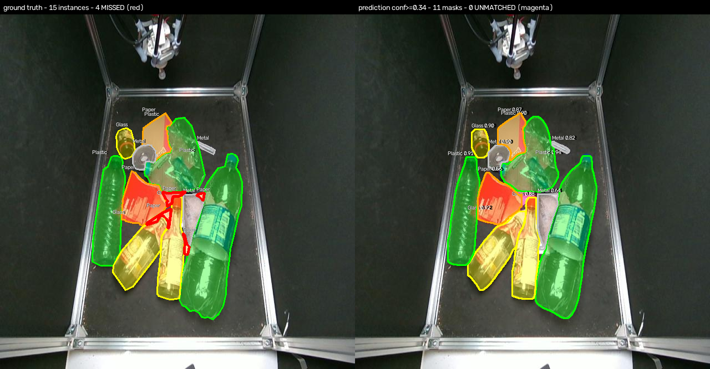
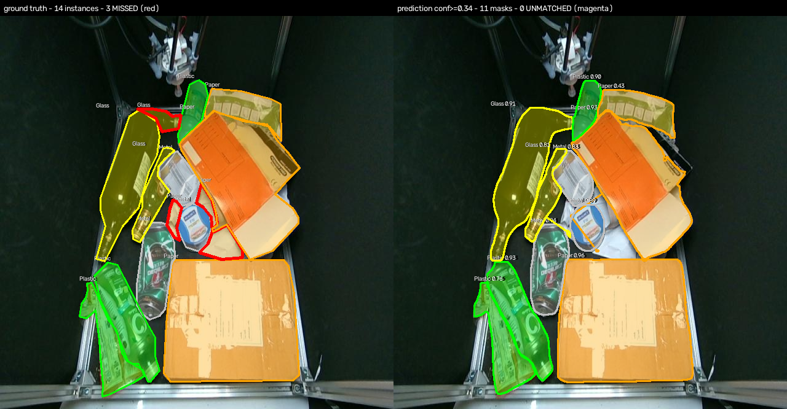
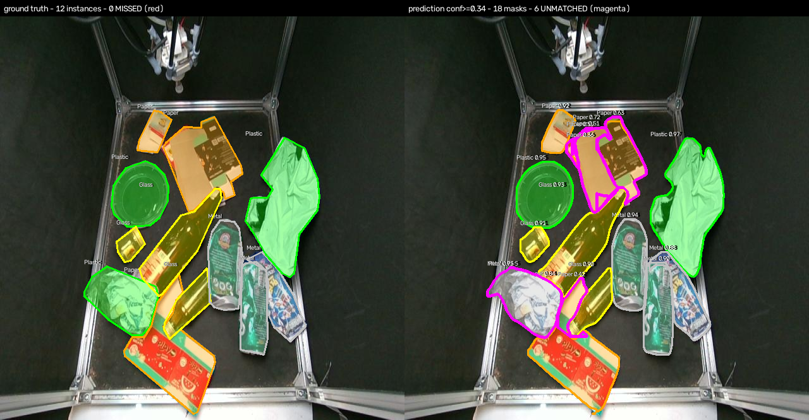
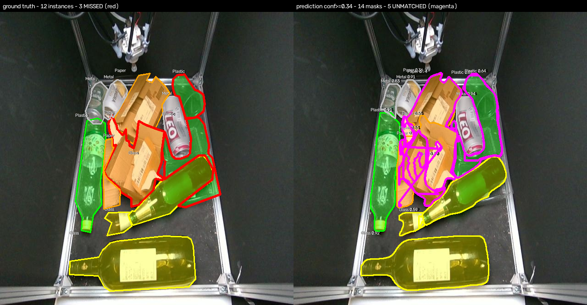
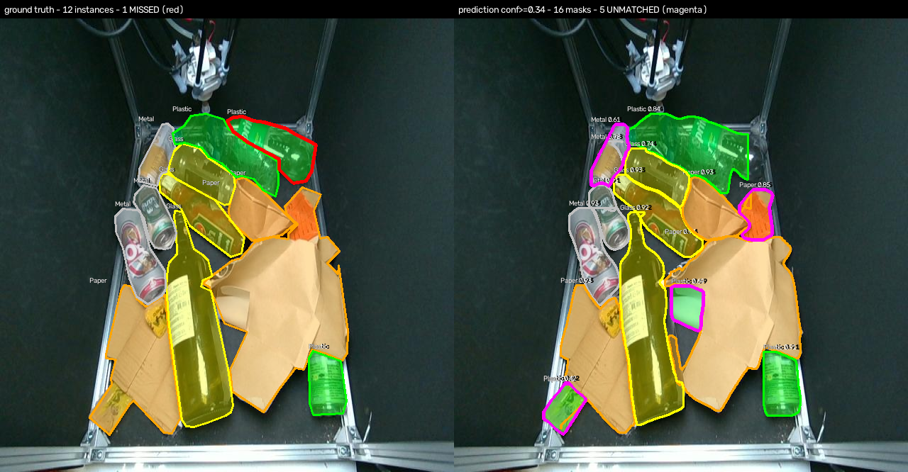
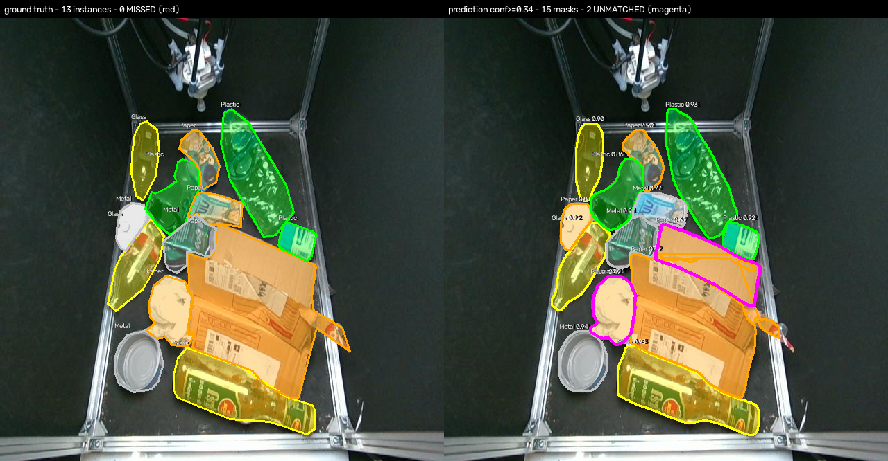
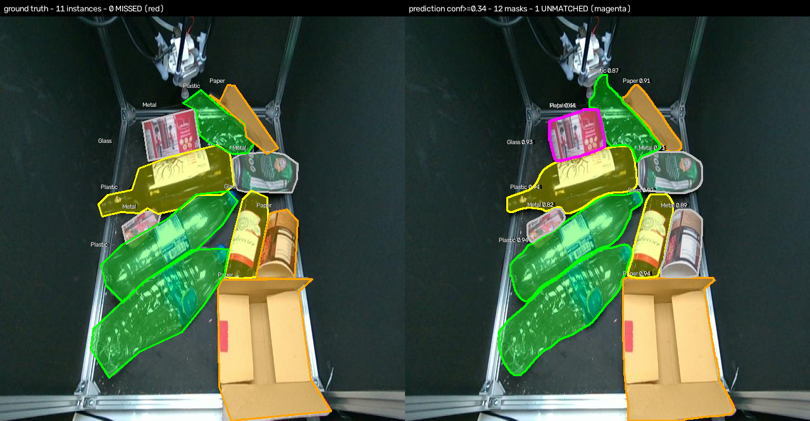
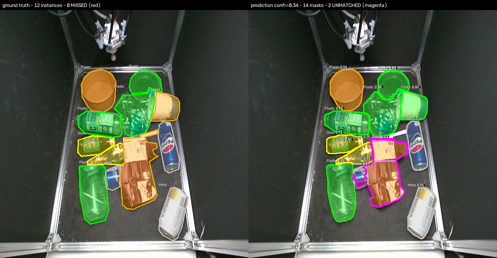

# Commented error examples

Split `val`, matching on mask IoU >= 0.5 at confidence >= 0.34, class-agnostic, greedy one-to-one (the convention of §7.1).

Left panel is ground truth, right panel the predictions. **Red** outlines mark ground-truth instances the model did not find; **magenta** outlines mark predictions that matched no ground-truth instance. Class fills use the dataset's own colour convention.

**Licence.** Source images are from the BUU Waste Occlusion Dataset (BUU-WOD), VisionLab, Burapha University, used under CC BY 4.0 (<https://creativecommons.org/licenses/by/4.0/>). **Modified:** polygon fills, outlines and class labels were drawn over the originals by this project. The underlying images and annotations were not altered.

## False negatives - objects the model did not find

### 1. `rgb_20250620_170415_png.rf.0f5ad9bf9da378a4f7cd7b321e4e4262`

`rgb_20250620_170415_png.rf.0f5ad9bf9da378a4f7cd7b321e4e4262` - ground truth 15 instances, 11 predictions. True positives **11**, missed **4**, false positives **0**, confused **0**.
On this image: recall **0.73**, precision **1.00**.

- **Missed (4):** Paper 4. Median ground-truth area 328 px, which is size quartile **q1** of 4 for this split.

### 2. `rgb_20250618_175840_png.rf.b7c1eeb32e3652d5606bcab893fcde73`

`rgb_20250618_175840_png.rf.b7c1eeb32e3652d5606bcab893fcde73` - ground truth 12 instances, 14 predictions. True positives **9**, missed **3**, false positives **5**, confused **0**.
On this image: recall **0.75**, precision **0.64**.

- **Missed (3):** Paper 1, Plastic 2. Median ground-truth area 8,480 px, which is size quartile **q3** of 4 for this split.
- **Unmatched predictions (5):** Plastic 0.81, Plastic 0.64, Paper 0.55, Paper 0.51, Paper 0.36.
  **0 of these sit on an instance that was already matched** — a duplicate detection — and **5 overlap no instance at all**. Matching is one-to-one, so a second prediction on a correctly detected object cannot match and is counted as a false positive although it covers a real object.

### 3. `rgb_20250619_160726_png.rf.0e16057f88e0e45befd72095ae473b09`

`rgb_20250619_160726_png.rf.0e16057f88e0e45befd72095ae473b09` - ground truth 14 instances, 11 predictions. True positives **11**, missed **3**, false positives **0**, confused **0**.
On this image: recall **0.79**, precision **1.00**.

- **Missed (3):** Glass 1, Paper 2. Median ground-truth area 1,300 px, which is size quartile **q1** of 4 for this split.

## False positives - predictions matching no object

### 1. `rgb_20250711_162604_png.rf.65c079be6c8cc47b6b37749847a05b54`

`rgb_20250711_162604_png.rf.65c079be6c8cc47b6b37749847a05b54` - ground truth 12 instances, 18 predictions. True positives **12**, missed **0**, false positives **6**, confused **0**.
On this image: recall **1.00**, precision **0.67**.

- **Unmatched predictions (6):** Metal 0.75, Paper 0.63, Paper 0.55, Paper 0.51, Paper 0.42, Paper 0.36.
  **2 of these sit on an instance that was already matched** — a duplicate detection — and **4 overlap no instance at all**. Matching is one-to-one, so a second prediction on a correctly detected object cannot match and is counted as a false positive although it covers a real object.

### 2. `rgb_20250618_175840_png.rf.b7c1eeb32e3652d5606bcab893fcde73`

`rgb_20250618_175840_png.rf.b7c1eeb32e3652d5606bcab893fcde73` - ground truth 12 instances, 14 predictions. True positives **9**, missed **3**, false positives **5**, confused **0**.
On this image: recall **0.75**, precision **0.64**.

- **Missed (3):** Paper 1, Plastic 2. Median ground-truth area 8,480 px, which is size quartile **q3** of 4 for this split.
- **Unmatched predictions (5):** Plastic 0.81, Plastic 0.64, Paper 0.55, Paper 0.51, Paper 0.36.
  **0 of these sit on an instance that was already matched** — a duplicate detection — and **5 overlap no instance at all**. Matching is one-to-one, so a second prediction on a correctly detected object cannot match and is counted as a false positive although it covers a real object.

### 3. `rgb_20250619_163757_png.rf.512ef001dde4d81e91af938cae4dae08`

`rgb_20250619_163757_png.rf.512ef001dde4d81e91af938cae4dae08` - ground truth 12 instances, 16 predictions. True positives **11**, missed **1**, false positives **5**, confused **0**.
On this image: recall **0.92**, precision **0.69**.

- **Missed (1):** Plastic 1. Median ground-truth area 5,585 px, which is size quartile **q2** of 4 for this split.
- **Unmatched predictions (5):** Paper 0.85, Plastic 0.69, Metal 0.61, Paper 0.48, Plastic 0.42.
  **1 of these sit on an instance that was already matched** — a duplicate detection — and **4 overlap no instance at all**. Matching is one-to-one, so a second prediction on a correctly detected object cannot match and is counted as a false positive although it covers a real object.

## Class confusion - matched but mislabelled

### 1. `rgb_20250619_171308_png.rf.4f89c7bcb4c78d37778a9c0a301e4b68`

`rgb_20250619_171308_png.rf.4f89c7bcb4c78d37778a9c0a301e4b68` - ground truth 13 instances, 15 predictions. True positives **10**, missed **0**, false positives **2**, confused **3**.
On this image: recall **1.00**, precision **0.87**.

- **Unmatched predictions (2):** Paper 0.67, Paper 0.49.
  **1 of these sit on an instance that was already matched** — a duplicate detection — and **1 overlap no instance at all**. Matching is one-to-one, so a second prediction on a correctly detected object cannot match and is counted as a false positive although it covers a real object.
- **Confused:** Metal -> Paper x1, Paper -> Metal x1, Paper -> Plastic x1.

### 2. `rgb_20250618_174626_png.rf.acc5bfe9303ace1fca79e31a11b764e7`

`rgb_20250618_174626_png.rf.acc5bfe9303ace1fca79e31a11b764e7` - ground truth 11 instances, 12 predictions. True positives **9**, missed **0**, false positives **1**, confused **2**.
On this image: recall **1.00**, precision **0.92**.

- **Unmatched predictions (1):** Metal 0.44.
  **1 of these sit on an instance that was already matched** — a duplicate detection — and **0 overlap no instance at all**. Matching is one-to-one, so a second prediction on a correctly detected object cannot match and is counted as a false positive although it covers a real object.
- **Confused:** Metal -> Paper x1, Paper -> Metal x1.

### 3. `rgb_20250618_175229_png.rf.58d777bdf6fc1023d34671092ed70d5d`

`rgb_20250618_175229_png.rf.58d777bdf6fc1023d34671092ed70d5d` - ground truth 12 instances, 14 predictions. True positives **10**, missed **0**, false positives **2**, confused **2**.
On this image: recall **1.00**, precision **0.86**.

- **Unmatched predictions (2):** Paper 0.63, Paper 0.38.
  **1 of these sit on an instance that was already matched** — a duplicate detection — and **1 overlap no instance at all**. Matching is one-to-one, so a second prediction on a correctly detected object cannot match and is counted as a false positive although it covers a real object.
- **Confused:** Paper -> Metal x1, Paper -> Plastic x1.

